# 🎬 MBooking - Flutter Movie Booking UI

A Flutter project built to practice modern Flutter application development by recreating a movie ticket booking UI from a Figma Community design.

> **Note**
>
> This project is created for learning and portfolio purposes only.
> It is **NOT** affiliated with the original designer and is **NOT** intended for commercial use.
>
> **Design Credit:** Original UI Design by **Truong Huy**  
> Figma Community: https://www.figma.com/community/file/1329360533750743940


## 🎥 Demo

<p align="center">
  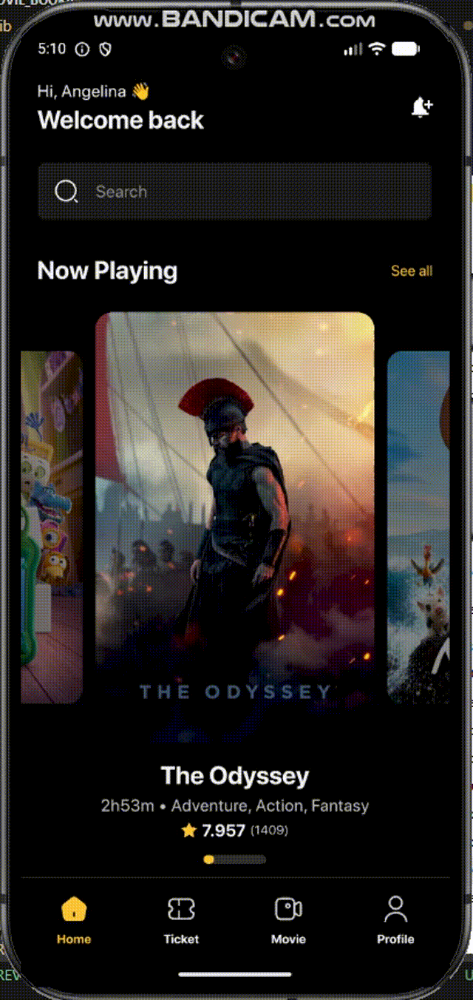
</p>

## 📱 Preview

<table>
  <tr>
    <th>Home</th>
    <th>Browse Movies</th>
    <th colspan="3">Movie Detail</th>
  </tr>
  <tr>
    <td>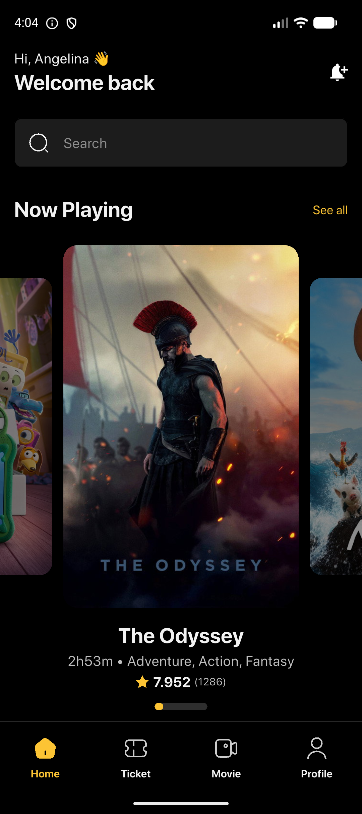</td>
    <td>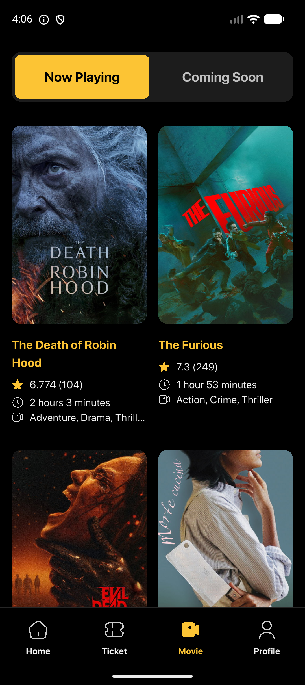</td>
    <td>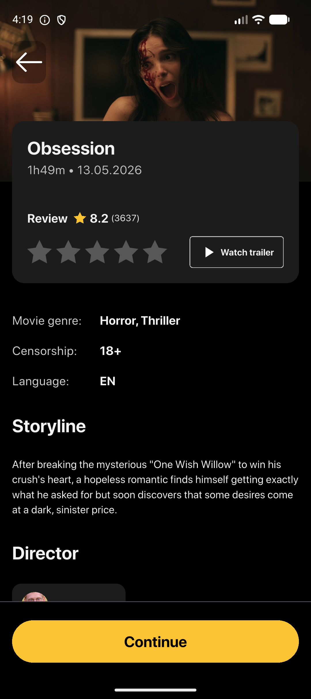</td>
    <td>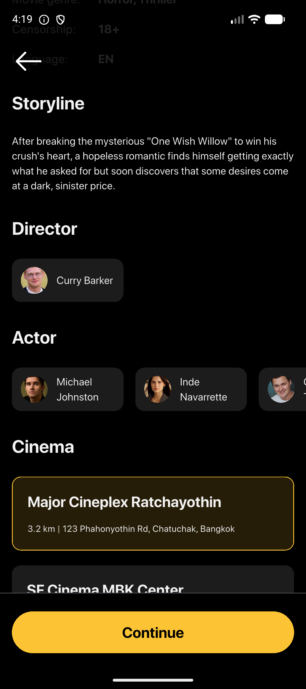</td>
    <td>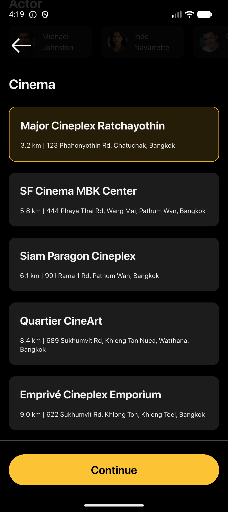</td>
  </tr>
</table>

<br>

<table>
  <tr>
    <th>Seat Selection</th>
    <th>Payment</th>
    <th>Ticket Detail</th>
    <th>My Ticket</th>
    <th>Profile</th>
  </tr>
  <tr>
    <td>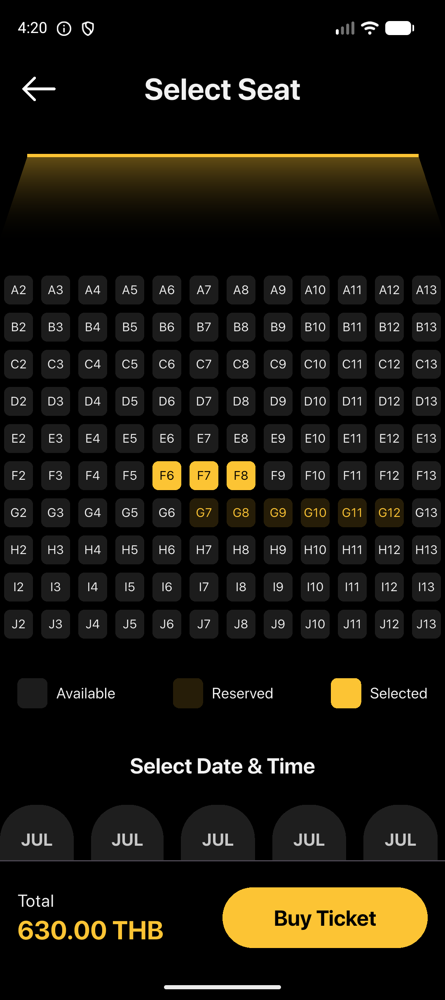</td>
    <td>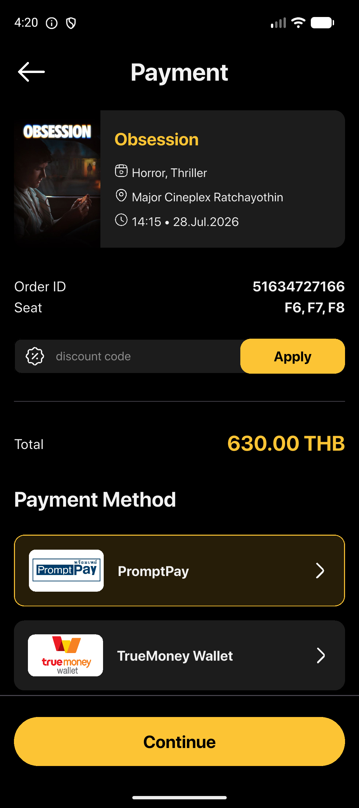</td>
    <td>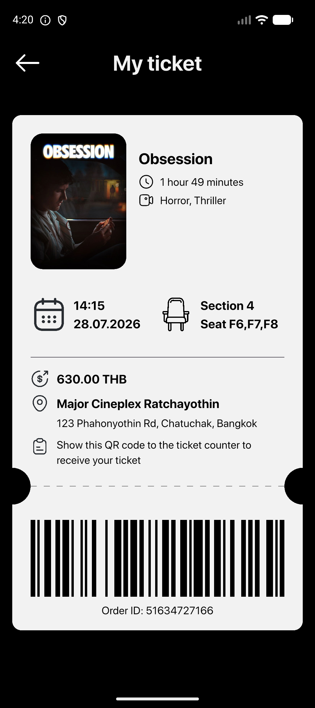</td>
    <td>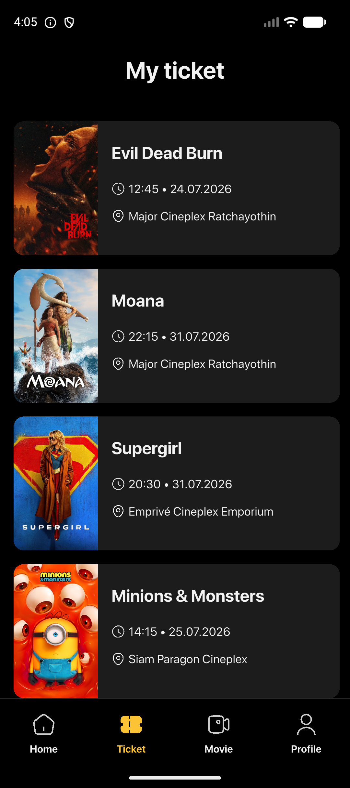</td>
    <td>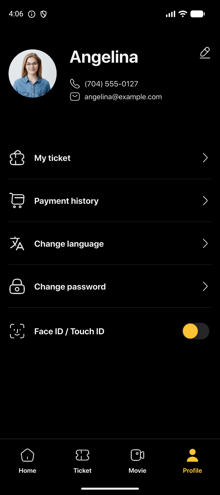</td>
  </tr>
</table>

## ✨ Features

- Browse Now Playing and Coming Soon movies
- View movie details
- Interactive seat selection
- Purchase movie tickets
- View ticket history

## 💡 Highlights

- Integrated with the **TMDB API** for real movie data
- Feature-first architecture with the BLoC pattern
- Responsive UI for different screen sizes
- Mock ticket booking flow with local persistence

## 🔨 Tech Stack

- Flutter
- Dart
- Bloc
- GoRouter
- GetIt
- Dio
- Json Serializable
- Flutter Dotenv
- Flutter Gen
- TMDB API

## 🗂️ Architecture

This project follows a **Feature-First Architecture** with the **BLoC pattern** for state management.

### Project Structure

```text
lib/
├── core/          # Shared infrastructure
├── screens/       # Feature modules
├── gen/           # Generated files
├── models/        # Shared models
└── main.dart
```

Each feature follows a consistent structure:

```text
screens/
├── bloc/          # State management
├── data/          # Repository & data sources
└── views/         # Screens & widgets
```

### Layers

| Layer | Responsibility |
| --- | --- |
| **Presentation** (`views/`) | Flutter widgets and UI rendering |
| **Business Logic** (`bloc/`) | Handles events and manages application state |
| **Data** (`data/`) | Repositories, API communication, and data mapping |

### Key Patterns

- **Feature-First** — Organize code by feature
- **BLoC** — State management using Events & States
- **Repository Pattern** — Decouple data sources from UI
- **Dependency Injection** — GetIt
- **Navigation** — GoRouter

## 📋 Development Environment

- Flutter SDK **3.41.7**
- Dart SDK **3.11.5**

## 🚀 Getting Started

### 1. Clone the repository

```bash
git clone https://github.com/kasidit-tim/movie-booking-ticket.git
cd movie_booking_ticket
```

---

### 2. Configure TMDB API

Open `.env.example` and follow the instructions inside the file.

---

### 3. Install dependencies

```bash
flutter pub get
```

---

### 4. Generate code

```bash
dart run build_runner build --delete-conflicting-outputs
```

---

### 5. Run the application

```bash
flutter run
```

---
